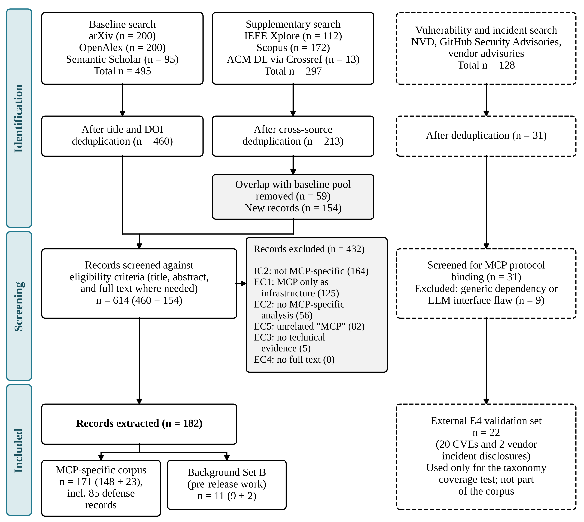
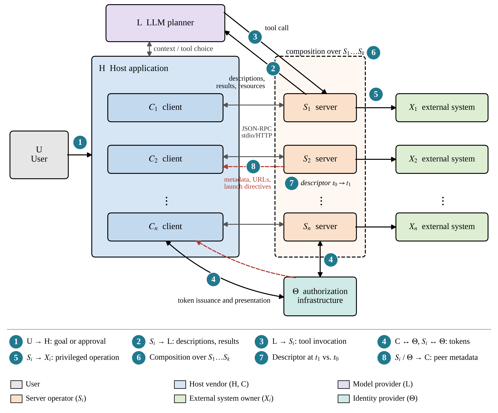

Received: d month yyyy \| Revised: d month yyyy \| Accepted: d month yyyy \| Published online: d month yyyy

**REVIEW**

# Security of Model Context Protocol in Agentic AI Systems: A Systematization of Knowledge on Threats, Trust Boundaries, and Defense Mechanisms

AI and Security Convergence

yyyy, Vol. XX(XX) 1–5

DOI: 10.47852/bonviewAISCXXXXXXXX

**\[Author names, with affiliation numbers; mark the corresponding author with \*\]**

*^1^ \[Department, Organization, Country, Email address\]*

**\*Corresponding author:** \[Name, Department, Organization, Country. Email: address at the institution where the research was conducted\]

**Abstract:** The Model Context Protocol (MCP) lets language-model agents call external tools through a standard interface and places a third-party server between the agent's planner and the user's data. We systematize what is known about MCP security. Following scoping-review and multivocal-review guidelines, we screened 614 deduplicated records from six academic databases and gray-literature sources and built a corpus of 171 MCP-specific works published between the protocol's release in November 2024 and September 2026; a second reviewer audited the sole inclusions of the first. We contribute a taxonomy of sixteen attack classes in four layers, a trust boundary model of eight crossings with a stated security property for each, a comparison of five specification revisions against those properties, a maturity grading of 85 defenses, and a ranked roadmap of research gaps. The latest revision (2026-07-28) partially addresses three of the sixteen classes and fully addresses none. A formative coverage test against 22 disclosed vulnerabilities and incidents absorbed 17 records under the original fourteen classes and 20 after the test led us to add two classes. Of the 85 defenses, 68 (80.0%) were evaluated only by their authors, 2 (2.4%) were evaluated independently, 15 (17.6%) are conceptual, and none reached deployment-level maturity; only 3 of 70 evaluated defenses (4.3%) faced a test aimed at their own mechanism. A case study of a documented incident shows three violated properties in a session where every call was authorized. Independent, adaptive evaluation of structural defenses ranks first among seven research gaps.

**Keywords:** Model Context Protocol, agentic AI security, trust boundaries, tool poisoning, defense maturity

## 1. Introduction

Large language model (LLM) agents now read files, query databases, send messages, and modify code repositories on behalf of their users. Anthropic released the Model Context Protocol (MCP) in November 2024 as an open standard for connecting models to such external systems [1]. A host application runs one or more MCP clients, and each client holds a session with an MCP server that exposes tools, resources, and prompts over JSON Remote Procedure Call (JSON-RPC) 2.0 [2]. Within a year, major model providers and developer tools had adopted the protocol; X. Li and Gao [3] analyzed 67,057 servers across six public registries.

MCP changes the security posture of agentic systems in a specific way. The protocol delivers server-authored natural language (tool names, descriptions, parameter schemas, and results) into the model's context, and the model uses that text to choose its next privileged operation. One channel therefore carries both data and potential adversarial instructions. Prompt injection, confused deputies, and supply-chain compromise predate MCP [4]; MCP places them inside a standardized, dynamically discoverable architecture in which third parties author model-visible metadata and one host combines capabilities from many independently administered servers.

Attackers exploit this arrangement. A tool description can instruct an agent to read the user's Secure Shell (SSH) keys and leak them through a tool parameter [5]. The MCPTox benchmark, built from 353 tools on 45 live servers, measured a mean attack success rate of 36.5% across 20 LLM agents [6]. Zhao et al. [7] catalogued 12,230 tools across 1,360 servers that injected content can chain into data-exfiltration workflows. Among 7,973 remote servers, 40.55% exposed tools without authentication, and each of the 119 testable OAuth deployments had at least one flaw [8].

Research has moved from vendor disclosures in early 2025 to papers at the IEEE Symposium on Security and Privacy [7], the IEEE/IFIP International Conference on Dependable Systems and Networks [3], and the AAAI Conference [6], and in *ACM Transactions on Software Engineering and Methodology* [2] and *IEEE Transactions on Software Engineering* [9]. Four problems remain. First, existing taxonomies divide the threat space along incompatible axes: attacker type across a server lifecycle [2], attack surfaces [10], attack categories [9], the STRIDE threat model over protocol components [11], or security versus safety [12]. None ties each attack class to the trust boundary it crosses, which a designer needs to decide where a control belongs. Second, the protocol keeps changing. The specification added an optional OAuth 2.1 authorization framework in March 2025, audience-bound tokens and a ban on token passthrough in June 2025, client identifier metadata documents in November 2025, and a stateless design that deprecated server-initiated sampling in July 2026 [13]. A finding against one revision need not hold for another, and few studies report which revision they tested. Third, the defense literature lacks a shared standard of evidence. Proposals range from metadata scanners and signed tool definitions to runtime monitors and information-flow architectures [14–16], and authors call them practical or effective under different criteria. Fourth, existing reviews list open problems without ranking them.

We address these problems with a Systematization of Knowledge (SoK) built on a systematically constructed corpus, and we make four contributions. **C1, MCP Security Taxonomy:** sixteen attack classes in four layers, each recorded with its entry channel, the trust boundary it crosses, and the protocol assumption it exploits, tested against disclosed Common Vulnerabilities and Exposures (CVE) records and incidents. **C2, Trust Boundary Model:** seven trust zones and eight crossings, each with a stated security property, separating local from remote deployments and comparing MCP with native function calling and the Agent2Agent (A2A) protocol. **C3, Defense Maturity Analysis:** a grading of each defense on an explicit evidence scale, mapped to the classes and crossings it evaluated. **C4, Research Gap Roadmap:** open problems ranked by the severity of the uncovered threat and the tractability of the research.

We restrict the scope to security, meaning adversarial compromise of confidentiality, integrity, availability, and authorization; model alignment and task reliability fall outside it. We cover specification revisions 2024-11-05 through 2026-07-28 and treat work published before MCP's release, such as indirect prompt injection studies and benchmarks [4, 17], as background.

Table 1 positions this SoK against prior reviews. Hou et al. [2] supplied the first architectural and lifecycle analysis, Gaire et al. [12] an SoK centered on the security-safety distinction, and Anbiaee et al. [17] a comparison of protocol-level risks across four agent protocols. Three later works address defenses. Tamayo [18] reviewed 73 defense studies from 2022 to 2025 and found that 93.2% relied on custom evaluations and 23.3% reported effectiveness, although that review reaches back before MCP's release. Rostamzadeh et al. [20] mapped defenses onto a defense-placement taxonomy and found protection uneven and tool-centric, and Nandish et al. [21] grouped inherent risks from 18 studies into four deficits (capability, privilege, quality, and supply chain). We add a trust boundary model as the organizing axis, record the specification revision behind each finding, grade defenses by evidence rather than by claim, and rank open problems.

**Table 1**

**Positioning of this work relative to prior reviews of MCP security**

| **Work** | **Type** | **Primary organizing axis** | **Coverage** |
|---|---|---|---|
| Hou et al. [2] | Survey with case studies | Attacker type × four-phase server lifecycle | MCP; 2026 (journal) |
| Gaire et al. [12] | SoK | Adversarial security vs. epistemic safety | MCP; December 2025 (arXiv) |
| C. Huang et al. [11] | Threat model with client evaluation | STRIDE/DREAD over five components | MCP; 2026 (journal) |
| Anbiaee et al. [17] | Comparative threat model | Protocol-level risk categories | MCP, A2A, and two others; February 2026 |
| Tamayo [18] | Systematic literature review | Defense mechanisms | MCP; 73 studies, 2022–2025 |
| Rostamzadeh et al. [20] | Defense-placement taxonomy | Layer responsible for enforcement | MCP; April 2026 (arXiv) |
| Nandish et al. [21] | Systematic analysis of 18 studies | Four inherent-risk deficits | MCP; 2026 (book series) |
| **This work** | SoK with systematic corpus | Trust boundaries crossed, per specification revision | MCP, compared with function calling and A2A; September 2026 |

Section 2 describes the method. Sections 3 to 8 present the trust boundary model, the taxonomy, the specification analysis, the defense maturity analysis, a case study, and the roadmap. Section 9 discusses the results and concludes.

## 2. Review Methodology

### 2.1. Review design

We combine an SoK, which contributes organizing frameworks, with a systematic review, which contributes reproducible coverage. We followed the Preferred Reporting Items for Systematic Reviews and Meta-Analyses extension for scoping reviews (PRISMA-ScR) [22], because we map concepts, evidence types, and gaps rather than pool effect sizes. PRISMA-ScR does not require critical appraisal; we graded evidence anyway (Section 2.6) because the Defense Maturity Analysis depends on it. Because much MCP security knowledge first appeared in specifications, government guidance, and vulnerability disclosures, we also followed multivocal review guidelines [23] and the search and extraction procedures of Kitchenham and Charters [24].

### 2.2. Research questions and time window

Table 2 lists one research question per contribution. The review window opens on 25 November 2024, the date of MCP's public release [1], and closes on 25 September 2026. We tracked five specification revisions: 2024-11-05, 2025-03-26, 2025-06-18, 2025-11-25, and 2026-07-28 [13]. Pre-release work entered a separate background set (Set B), which supplies concepts such as indirect prompt injection [4] and dynamic agent security benchmarks [17] but enters no quantitative statement.

**Table 2**

**Research questions and corresponding contributions**

| **ID** | **Research question** | **Contribution** |
|---|---|---|
| RQ1 | Which MCP-specific attack classes does the literature document, and which protocol features and assumptions does each exploit? | C1 (Section 4) |
| RQ2 | Where do trust boundaries lie in local and remote deployments, how do authentication and authorization enforce them across revisions, and how does MCP compare with function calling and A2A? | C2 (Sections 3 and 5) |
| RQ3 | Which defenses exist, which classes and boundaries does each cover, and how mature is the evidence for each? | C3 (Section 6) |
| RQ4 | Which research gaps remain, and which should the community address first? | C4 (Section 8) |

### 2.3. Information sources and search strategy

We searched six bibliographic sources: IEEE Xplore (112 records), the ACM Digital Library via the Crossref API (13), Scopus (172), arXiv categories cs.CR, cs.AI, cs.SE, and cs.CL (200), OpenAlex (200), and Semantic Scholar (95). Because "MCP" collides with unrelated terms in engineering and medicine, every query required the phrase "Model Context Protocol" or the acronym together with an agent or LLM term. We ran all queries on 25 September 2026 and added backward and forward snowballing [25] from five seed papers [2–3, 6–7, 9] until an iteration returned no new eligible record. The arXiv, OpenAlex, and Semantic Scholar queries returned 495 records (460 after deduplication). The IEEE Xplore, Scopus, and ACM queries returned 297 (213 unique), of which 59 overlapped the first pool, leaving 154 new records and a screening pool of 614.

Gray literature came from five source types: the five specification revisions; the OWASP GenAI Security Project, which contributed framing but no MCP-specific findings; government guidance, namely an MCP information sheet from the National Security Agency (NSA) [26]; vulnerability databases and package registries; and vendor disclosures and curated incident indices [27–28]. A naive query for the acronym in the National Vulnerability Database (NVD) and GitHub Security Advisories (GHSA) returned 98 candidates but only 3 true positives, because advisories name packages (for example, `mcp-server-git` or `fastmcp`) rather than the protocol. We therefore combined Boolean phrase queries, package-name prefixes across the npm, PyPI, and Maven registries, and Common Platform Enumeration vendor entries. This retrieved 128 candidates (31 after deduplication); screening removed 9 without a protocol binding, leaving 22 Tier E4 records (20 CVEs and 2 vendor disclosures). These form an external validation set outside the synthesis corpus (Section 4.3). Supplementary Table S1 lists all query strings and per-phase counts. We confirmed venues with DBLP and publisher proceedings.

### 2.4. Eligibility criteria

A record entered the corpus only if it met every inclusion criterion (IC) and no exclusion criterion (EC) in Table 3.

**Table 3**

**Eligibility criteria**

| **ID** | **Criterion** |
|---|---|
| IC1 | Published or posted between 25 November 2024 and 25 September 2026. |
| IC2 | Addresses MCP security specifically (attacks, vulnerabilities, threat models, authentication or authorization, defenses, or ecosystem measurements), or compares MCP with another tool-use paradigm on security grounds. |
| IC3 | Written in English. |
| IC4 | Peer-reviewed paper; preprint reporting a method with an evaluation or formal analysis; normative specification; government or standards-body guidance; or vulnerability disclosure with a CVE identifier or reproducible proof of concept. |
| EC1 | Uses MCP only as infrastructure for a non-security goal, such as capability benchmarking. |
| EC2 | Discusses LLM or agent security without MCP-specific analysis (pre-release foundational works enter Set B). |
| EC3 | Marketing material, opinion without technical evidence, or statistics without a traceable method. |
| EC4 | Full text not accessible. |
| EC5 | Uses "MCP" for an unrelated concept. |

### 2.5. Selection process and version reconciliation

Two reviewers, blind to each other and to any automated recommendation, independently screened a random 20% calibration sample (n = 92) of the 460-record baseline pool from title, abstract, and year, with venue and source withheld to avoid prestige bias. Agreement was 85.9% (79/92), and Cohen's κ = 0.734 indicates substantial agreement [29]. Disagreements produced two refinements. A substitution test operationalized MCP specificity: if a record's security claim survives unchanged when "MCP" is replaced by a generic tool-calling framework, the record fails IC2. Set B was restricted to pre-release work conceptually relevant to agent or tool-use security.

One reviewer screened the remaining records alone, applying the calibrated protocol to the 154 supplementary records as well. A second reviewer, blind to the first reviewer's decisions, re-screened 137 of the 138 records the first reviewer had included alone in the baseline pool; reconciliation excluded 37 (27.0%; Wilson 95% interval 20.3%–35.0%), mostly papers in which MCP was only a deployment interface. After this audit we recorded a rule for attack and defense papers: the threat or mechanism must be framed as a weakness or requirement of the MCP ecosystem; the central results must come from real MCP servers, tools, or clients (or, for designs without experiments, depend on MCP-specific elements); and the measurements must evaluate the claim. A blind re-screening of 84 at-risk sole exclusions reinstated none. Full-text checks retained, among others, two fault taxonomies grounded in mined MCP codebases [30–31]. Every candidate inclusion from the supplementary pool was dual-reviewed. Supplementary Section S3 details both audits.

Of the 614 records, 171 entered the MCP-specific corpus (148 from the baseline pool and 23 from the supplementary pool), 11 entered Set B, and 432 were excluded (IC2: 164; EC1: 125; EC2: 56; EC5: 82; EC3: 5; EC4: 0). Figure 1 summarizes the flow.

**Figure 1**

**PRISMA-ScR flow diagram of record identification, screening, and inclusion**

*Note.* The 22-record E4 validation set was identified separately and lies outside the 182 extracted records.

Because MCP security work moves from preprint to archival venue within months, we checked each record's DOI, venue proceedings, and latest arXiv journal reference on 25 September 2026. Where an archival version existed, we cited it and merged all versions into one record, using the archival figures. We also recorded the specification revision, software development kit (SDK) version, and client versions that each empirical study evaluated.

### 2.6. Evidence classification

We assigned every included record to one of five evidence tiers (Table 4). The tiers weight the synthesis; they do not exclude records. We appraised Tier E3 to E5 sources with the AACODS checklist of authority, accuracy, coverage, objectivity, date, and significance [32]; secondary incident aggregators [28] served only to corroborate primary disclosures.

**Table 4**

**Evidence tiers**

| **Tier** | **Evidence type** | **Examples** |
|---|---|---|
| E1 | Peer-reviewed empirical, measurement, or formal study | Archival conference and journal papers |
| E2 | Preprint with an empirical, measurement, or formal method | arXiv papers without an archival version |
| E3 | Normative specification or government and standards-body guidance | MCP specification revisions; NSA guidance |
| E4 | Practitioner disclosure with a CVE or reproducible proof of concept | Vendor security advisories; CVE records |
| E5 | Community guidance and consensus frameworks | OWASP projects |

We applied three synthesis rules: we did not pool attack success rates across benchmarks, which differ in threat model, models, and success criteria; we label any claim that rests only on E4 or E5 sources; and we excluded vendor statistics without a traceable method.

### 2.7. Data extraction and synthesis

The corresponding author extracted all 182 records (171 MCP-specific and 11 Set B) with the form in Supplementary Table S2, and a second author verified the 20% calibration sample.

*Taxonomy (C1).* We open-coded attack descriptions and grouped codes into classes by entry channel and exploited assumption, then reconciled the classes with four prior schemes [2, 9–11]. We tested coverage against the external E4 validation set and report absorption before and after the revisions the test prompted, with 95% Wilson score intervals; because the test shaped the taxonomy, it is a formative refinement step, not a held-out test.

*Trust Boundary Model (C2).* We derived zones and crossings from the architecture and authorization sections of each revision and from threat models in the corpus, expressed each security property as a predicate over principals, data origin, and actions, and traced a documented incident through the model (Section 7).

*Defense Maturity Analysis (C3).* We assigned each defense one of four levels: L0, conceptual (no evaluated implementation); L1, prototyped and evaluated by its authors; L2, evaluated by another party; and L3, deployed (normative in the specification or shipped in production tooling). We flagged separately whether any evaluation used an adaptive adversary. Deployment and evidence of effectiveness are separate attributes.

*Research Gap Roadmap (C4).* We drew candidate gaps from taxonomy cells without an L2 or L3 defense, contradictions between studies, and limitations that authors state, and ranked them by severity and tractability (Section 8).

### 2.8. Threats to validity

*Construct validity.* Authors name similar attacks differently ("rug pull," "descriptor drift," "post-approval mutation"); a synonym table mapped every term to one class. *Internal validity.* A single primary screener and coder can introduce bias. The audit removed 27.0% of the first reviewer's sole inclusions, so the risk was material; the exclusion audit has little power to detect missed inclusions because the second reviewer tends to exclude, and the post-audit rule applied only to audited records. *Coverage validity.* Six databases reduce database-specific recall gaps; the IEEE Xplore, Scopus, and ACM search added 23 MCP-specific records absent from the baseline pool, and 26.3% of its unique records overlapped that pool. Search recall itself was not tested. *External validity.* Conclusions hold as of 25 September 2026. The 20 CVEs concern TypeScript/Node.js (10), Python (9), and Java (1) implementations, so findings on implementation flaws reflect those stacks; Go, Rust, and C# implementations have no public CVEs yet. *Conclusion validity.* Several gray-literature sources come from security vendors, and benchmark results do not compare across studies; the tiers and synthesis rules of Section 2.6 address both.

### 2.9. Use of generative AI tools

In line with the journal's policy and Committee on Publication Ethics (COPE) guidance, we disclose the use of generative AI (Claude, Anthropic). Beyond drafting assistance, an AI assistant executed parts of the review pipeline under author direction: running the queries in Supplementary Table S1, deduplicating and reconciling versions, preparing blinded screening worksheets (automated recommendations were withheld from the reviewers), computing inter-rater statistics, and checking data consistency. Human reviewers made every inclusion, exclusion, and reconciliation decision. We verified all bibliographic details and reported figures against primary or Crossref-indexed sources. The authors take full responsibility for the content.

## 3. MCP Architecture and the Trust Boundary Model

### 3.1. Architecture and operational primitives

MCP defines three roles. A **host** is the application the user interacts with, such as an integrated development environment (IDE) or chat client. It embeds one or more **clients**, each holding a one-to-one JSON-RPC 2.0 connection with a **server** [13]. A server exposes up to four capabilities: **tools** (tools/list, tools/call), named functions with a natural-language description and a JSON Schema; **resources** (resources/read), addressable read-only context; **prompts** (prompts/get), parameterized templates; and **sampling** (sampling/createMessage), through which a server requests a completion from the client's model. Revisions through 2025-11-25 negotiated capabilities in an initialize handshake within a stateful session; the 2026-07-28 revision removed the handshake and protocol-level sessions, deprecated sampling, and replaced server-initiated requests with a multi-round-trip pattern [13]. Whatever a tool call or resource read returns enters the planner's context verbatim, and no wire-format field distinguishes data from instruction. A host commonly connects to several independently administered servers, and the planner sees the union of their descriptions [2].

Two transports carry a session. **stdio** runs the server as a local subprocess that inherits the host's operating-system identity, environment variables, and file permissions. **Streamable HTTP**, which replaced HTTP with server-sent events (SSE) in 2025-03-26, is the only transport to which the optional OAuth 2.1 profile applies [13].

### 3.2. Trust zones

We model a deployment as a set of trust zones, each under its own administrative control (Table 5). Security properties belong to the crossings between zones, not to any single zone. We keep the user (U) and host (H) distinct because several documented attack classes are host- or vendor-side [2]. Figure 2 shows the zones and channels. The number of server zones grows with every connection the host makes, whereas a single-application integration has one vendor controlling every zone but U.

**Table 5**

**Trust zones in an MCP deployment**

| **Zone** | **Description** | **Administrative control** |
|---|---|---|
| U (User) | The human whose goal the session serves | The user |
| H (Host) | The application embedding the MCP clients | The host vendor |
| L (Planner) | The LLM that reasons and selects actions | The model provider |
| C (Client) | The per-server session object inside the host | The host vendor |
| Sᵢ (Server *i*) | An independently administered MCP server, *i* = 1…*n* | The server operator, generally a third party |
| Xᵢ (External system) | The data source, API, or environment behind Sᵢ | Whoever controls that system |
| Θ (Authorization infrastructure) | The OAuth authorization and resource servers governing a remote Sᵢ | The identity provider, possibly distinct from Sᵢ's operator |

**Figure 2**

**Trust zones and channels of an MCP deployment**

### 3.3. Boundary crossings and security properties

Table 6 lists the eight crossings a session exercises. For each, we state a normative invariant that a secure interaction must preserve and contrast it with current enforcement. We write principal(x) for the entity an action is attributable to and label(m) for whether message *m* acts as data or as control at the planner. These invariants are the yardstick for the specification analysis (Section 5) and the incident trace (Section 7). When a property fails there, the failure shows that MCP's wire format and authorization framework do not enforce it, leaving enforcement to host heuristics or external defenses.

**Table 6**

**Boundary crossings, normative security invariants, and enforcement status**

| **Crossing (what flows)** | **Normative invariant** | **Enforcement and evidence** |
|---|---|---|
| U → H (goal or approval) | principal(instruction acted on) = U, unless U delegated that action class | Host UI under benign conditions; bypassed when workspace configurations auto-execute (CVE-2025-54135) |
| Sᵢ → L via C, H (descriptions, results, resources) | ¬(label(m) = control ∧ origin(m) ∈ {Sᵢ, Xᵢ} ∧ ¬authorized-as-instruction-source(Sᵢ, U)) | Unenforced: no data/control framing; violated by injection and tool poisoning (A1–A3) |
| L → Sᵢ via C (invocation with arguments) | principal(invocation) = U for any privileged action | Partial: a token records a grant to the client, not who originated the instruction; 46.4% of 6,137 servers cache authorization insecurely [33] |
| C ↔ Θ, Sᵢ ↔ Θ (token issuance and use) | audience(t) = Sᵢ, and *t* confers no authority over Sⱼ, *j* ≠ *i* | Specified since 2025-06-18 but optional; about 70% of measured servers lack OAuth (40.55% unauthenticated, 29.00% static credentials) [8] |
| Sᵢ → Xᵢ (privileged operation) | action(Sᵢ, Xᵢ) ⊆ scope granted to principal(invocation) | Left to handler code; bypassed in 11 CVEs (C5; Section 4.3) |
| Composition over S₁…Sₖ (reachable capabilities) | No session combines untrusted input, a sensitive read, and external egress without re-consent | Unenforced; exploited at scale [7] and in a documented incident [27] |
| Descriptor at t₁ vs. t₀ (re-read definitions) | hash(descriptor at t₁) = hash(approved descriptor at t₀), or re-consent | Unenforced: tools/list permits unpinned runtime mutation (B1) [14] |
| Sᵢ / Θ → C (metadata, URLs, launch directives) | A peer-supplied string reaches a local process or shell sink only after sanitization | Left to client adapters; violated by CVE-2025-6514 and CVE-2025-54135 (C6) |

The second row states the root cause behind tool poisoning and injection through results and resources; the third and fourth state the confused-deputy and token-scope properties. Z. Li et al. [35] title their attack a confused-deputy attack, but it lies on the second crossing: a server whose manipulated metadata overshadows a benign one hijacks tool selection in up to 90.89% of trials across 14 models on two hosts, and MCP-Scan detected none of the resulting servers. Because the hijack redirects an invocation without exploiting session authority, we classify it under A1 and A3, not C1.

### 3.4. Local versus remote deployments

The two transports instantiate Table 6 differently (Table 7). Under stdio, C and Sᵢ share the host's process trust, Θ does not exist, and only host sandboxing can enforce principal(invocation). Under Streamable HTTP with authorization, Θ is an OAuth 2.1 authorization-server and resource-server pairing, and Sᵢ must reject tokens bound to other servers; Section 5.2 reports how often deployments meet this.

**Table 7**

**Local versus remote deployment profiles**

| **Dimension** | **stdio (local)** | **Streamable HTTP (remote)** |
|---|---|---|
| Identity basis | Ambient OS user (UID, environment, working directory) | OAuth 2.1 audience-bound bearer token (optional; static tokens common) |
| Network exposure | None (local IPC) | Internet, intranet, or cloud VPC |
| Dominant failure | Command injection, path traversal, credential leakage via inherited environment | Unauthenticated endpoints (40.55%) [8], registry spoofing, cross-tenant leakage |
| Isolation responsibility | Host (the specification does not require sandboxing) | Server operator (container and network isolation) |

### 3.5. Comparison with function calling and A2A

Table 8 restates the zone structure for two related paradigms. Native function calling collapses Sᵢ, Xᵢ, and Θ into H, removing the third-party server at the cost of interoperability. The A2A protocol [35] connects a client agent to a remote peer agent that publishes a signed Agent Card, so its critical crossing is peer authenticity rather than tool-descriptor integrity. A deployment combining both, a common pattern [18], inherits every crossing of Table 6 for its MCP legs and adds a peer-authentication crossing for its A2A legs; semantic manipulation of an A2A peer can trigger an MCP tool call [36]. Section 8 returns to this composition (gap 7).

**Table 8**

**Trust-boundary comparison across agent interaction paradigms**

| **Dimension** | **Native function calling** | **MCP** | **A2A** |
|---|---|---|---|
| Discovery | Static, compiled into host code | Dynamic (tools/list) | Dynamic, via Agent Card |
| Zones collapsed into H | Sᵢ, Xᵢ, Θ | None | None (adds a peer-authenticity crossing) |
| Data/control separation at the planner | Low (static schema still enters the prompt) | None (unstructured text) | Moderate (structured task negotiation) |
| Dominant failure | Host implementation bugs | Confused deputy, tool poisoning | Peer impersonation, manipulated delegation |

## 4. MCP Security Taxonomy

### 4.1. Construction and reconciliation with prior schemes

Open coding of every corpus attack description yielded sixteen classes, which we group into four layers by the Table 6 crossing each violates. Table 9 reconciles them with the four corpus schemes that propose a taxonomy: 16 scenarios across attacker types and a four-phase lifecycle [2], 17 attack types over four surfaces [10], four categories (tool poisoning, puppet attacks, rug pull, malicious external resources) [9], and a STRIDE mapping over five components [11].

**Table 9**

**Reconciliation of this taxonomy with four prior schemes**

| **This taxonomy** | **Hou et al. [2]** | **Yang et al. [10]** | **Song et al. [9]** | **C. Huang et al. [11]** |
|---|---|---|---|---|
| A. Semantic channel (A1–A3) | Malicious-developer scenarios | Server surface (metadata, resources) | Tool poisoning; malicious external resources | Spoofing, tampering |
| B. Descriptor integrity over time (B1–B3) | Update and maintenance phases | Server surface | Rug pull | Tampering |
| C. Identity, authorization, and sinks (C1–C7) | External-attacker and security-flaw scenarios | Client and transport surfaces | Not separate | Spoofing, elevation of privilege |
| D. Composition across servers (D1–D3) | Not separate | Not separate | Puppet attacks (one pattern) | Information disclosure |

Row D is the clearest gap. Only the puppet attacks of Song et al. [9] isolate a cross-server mechanism, and they cover one pattern; the other schemes fold multi-server attacks into single-server categories, although the composition property fails even when every individual call is safe.

### 4.2. Layered taxonomy

Table 10 lists the sixteen classes. "Boundary" names the Table 6 crossing each class violates, and "Assumption exploited" states the design assumption the attack falsifies.

**Table 10**

**MCP security attack taxonomy**

| **Class** | **Entry channel** | **Boundary** | **Assumption exploited** | **Representative evidence** |
|---|---|---|---|---|
| **A1.** Tool metadata poisoning | Tool description or inputSchema | Sᵢ → L | Metadata is informational only | Mean attack success 36.5% across 20 agents, peak 72.8% [6]; [5]; selection hijacking up to 90.89% [34] |
| **A2.** Indirect injection via results or resources | tools/call or resources/read content | Sᵢ → L | Only the initial description needs vetting | Malicious external resources [9] |
| **A3.** Description-quality miscalls | Ambiguous or conflicting descriptions | Sᵢ → L | Ambiguity is a quality defect, not a security one | Description smells across 1,180 servers induce wrong selection [37]; exploited adversarially [34] |
| **B1.** Descriptor and configuration mutation | list_changed after approval; workspace launch configuration | Descriptor t₁ vs. t₀ | An approved descriptor or configuration stays fixed | Rug pull [14]; CVE-2025-54136 |
| **B2.** Registry and capability drift | Metadata re-fetched over time | Descriptor t₁ vs. t₀ | Drift is rare enough for periodic re-audit | 19,099 servers over 88.6 days; re-auditing the 5% most-drifted catches about 20% of later changes [38] |
| **B3.** Schema-mutation robustness failure | Interface change mid-session | Descriptor t₁ vs. t₀ | Planners degrade gracefully | 11 mutation operators across 123 servers [39] |
| **C1.** Confused deputy | Privileged action assembled by L | L → Sᵢ | The acting principal is whoever holds the session | Concept [40]; OAuth-proxy variant in the specification [41]; no pure attack without injection in the corpus; shown in an incident [27] |
| **C2.** Caller identity confusion | Repeated invocations on one session | L → Sᵢ | One authorization decision covers the session | 46.4% of 6,137 servers cache authorization insecurely [33] |
| **C3.** Missing or flawed transport authorization | Unauthenticated endpoint, missing origin checks, or flawed OAuth | C ↔ Θ, Sᵢ ↔ Θ | Deployers enable and correctly implement the profile | 40.55% of 7,973 servers unauthenticated; all 119 testable OAuth deployments flawed [8] |
| **C4.** Intent inversion via tool-call traces | Call sequence a server receives | L → Sᵢ | A server learns only what each call requires | Traces invert to the user's intent [42] |
| **C5.** Sink-side enforcement failure | Arguments consumed by server handlers | Sᵢ → Xᵢ | The server confines operations to its advertised scope | Static analysis flagged 5% of 100 repositories [43]; 11 CVEs (Table 11) |
| **C6.** Client-side sink enforcement failure | Peer metadata, authorization endpoints, launch parameters | Sᵢ / Θ → C | Peer-supplied strings are inert data | CVE-2025-6514; CVE-2025-54135 |
| **C7.** Authorization scoping and tenant isolation failure | Multi-tenant backend queries | Sᵢ → Xᵢ | Handlers partition tenant scopes | Asana disclosure [44]; [33] |
| **D1.** Parasitic toolchain and composed exfiltration | Chained calls across servers | Composition | Per-tool safety implies per-session safety | 12,230 chainable tools across 1,360 servers [7] |
| **D2.** Guardrail bypass under multi-step execution | Multi-step plans | Composition | A guardrail checked once holds for the plan | Bypassed guardrails among detected runtime faults [45] |
| **D3.** Supply-chain propagation via tool cloning | Registry-level code reuse | Sᵢ, pre-session | Published servers are independent | 60–85% of candidates across 7,508 repositories are clones [46] |

Layer A carries the densest evidence, consistent with the semantic channel being the field's distinguishing concern. Recent examples include genetically optimized descriptions that bias planner selection toward an attacker's server [47–48]. Layer D is the thinnest relative to its consequences, because composition failures need a multi-server testbed; cross-server memory exfiltration through parasitic tool parameters is one demonstrated case [49].

### 4.3. Taxonomy coverage test

We tested the taxonomy against the 22-record E4 validation set (Section 2.3), which does not count toward the synthesis corpus. Two reviewers mapped each record; agreement was 90.9% (20/22; κ = 0.87), and reconciliation reached consensus. Both coders used the revised class set, so this figure measures consistency on the revised taxonomy. Table 11 summarizes the mapping; Supplementary Table S4 gives severity scores, mechanisms, and adjudication notes.

**Table 11**

**Coverage test against the E4 validation set (n = 22: 20 CVEs and 2 incident disclosures)**

| **Record** | **Component** | **Crossing** | **Class** |
|---|---|---|---|
| CVE-2025-47274 [50] | ToolHive deployment utility | None (host credential storage) | Residue |
| CVE-2025-53109, CVE-2025-53110 [51–52] | Filesystem server | Sᵢ → Xᵢ | C5 |
| CVE-2025-68143, CVE-2025-68144, CVE-2025-68145, CVE-2026-27735 [53–56] | Git server | Sᵢ → Xᵢ | C5 |
| CVE-2025-53967 [57] | Framelink Figma server | Sᵢ → Xᵢ | C5 |
| CVE-2026-0755 [58] | gemini-mcp-tool | Sᵢ → Xᵢ | C5 |
| CVE-2026-39884 [59] | mcp-server-kubernetes | Sᵢ → Xᵢ | C5 |
| CVE-2025-65513 [60] | fetch-mcp-server | Sᵢ → Xᵢ | C5 |
| CVE-2026-32871 [61] | FastMCP OpenAPI provider | Sᵢ → Xᵢ | C5 |
| CVE-2026-35568, CVE-2025-66414, CVE-2025-66416 [62–64] | Java, TypeScript, and Python SDKs | C ↔ Θ, Sᵢ ↔ Θ | C3 |
| CVE-2025-49596 [65] | MCP Inspector | C ↔ Θ, Sᵢ ↔ Θ | C3 |
| CVE-2025-6514 [66] | mcp-remote client proxy | Sᵢ / Θ → C | C6 (added) |
| CVE-2025-54135 [67] | Cursor IDE | Sᵢ / Θ → C | C6 (added); A2 secondary |
| CVE-2025-54136 [68] | Cursor IDE | Descriptor t₁ vs. t₀ | B1 (extended) |
| CVE-2026-0621 [69] | TypeScript SDK URI template parser | None (availability) | Residue |
| Asana disclosure [44] | Multi-tenant server | Sᵢ → Xᵢ | C7 (added); C5 secondary |
| Invariant Labs disclosure [27] | GitHub server | Sᵢ → L → Sᵢ | A2; C1 and D1 secondary |

Under the fourteen classes defined before the test, 17 of 22 records (77.3%; Wilson 95% CI 56.6%–89.9%) were absorbed, with the Asana disclosure tentatively mapped to C2. Three were not (CVE-2025-6514, CVE-2025-54135, and CVE-2025-54136), and two were residue. The test prompted three revisions. CVE-2025-6514 is not an authorization failure: `mcp-remote` passes an attacker-supplied authorization endpoint URL to an operating-system launcher during OAuth discovery, so the client feeds peer metadata into an execution sink. We therefore defined C6 and added the Sᵢ / Θ → C crossing; CVE-2025-54135 also fits C6, with A2 secondary because prompt injection can write the configuration it executes. The Asana failure lay in the server backend's tenant scoping on Sᵢ → Xᵢ, not in a planner acting as a deputy on L → Sᵢ, so we defined C7 instead of stretching C2. CVE-2025-54136 led us to extend B1 from runtime change notifications to post-approval mutation of launch configurations. After revision, 20 of 22 records (90.9%; 72.2%–97.5%) are absorbed. Because the revised classes were shaped by the records they absorb, this figure describes formative refinement, not a held-out test (Section 8.3). Two records remain residue: host-side credential storage (CVE-2025-47274) and regular-expression denial of service (CVE-2026-0621). The taxonomy has no availability class (gap 5, Section 8.2).

Several records share a product or root cause, such as four Git-server CVEs and one Domain Name System (DNS) rebinding defect in three SDKs, so the intervals are too narrow. Counting each of the 15 product or root-cause clusters once gives 11 absorbed (73.3%; 48.0%–89.1%) before revision and 13 (86.7%; 62.1%–96.3%) after. Absorption also measures empirical coverage, not construct validity: half the records (11; 50.0%) are conventional handler defects in C5 that any taxonomy with a generic server-flaw category would absorb.

The two evidence streams differ. In the corpus, 91 of 171 records (53.2%) focus primarily on Layer A. In the validation set, Layer A is the primary class of one record [27] and a secondary class of one, while Layer C is primary for 18 of 22 (81.8%): C5 (11), C3 (4), C6 (2), and C7 (1); the rest are one B1, one A2, and two residue records. This asymmetry does not show that semantic attacks are rare. CVE Numbering Authorities assign identifiers to deterministic product defects and seldom to model behavior under injection, and our package-based retrieval reinforces that selection. The narrower conclusion holds: deployed MCP software also fails through conventional defects in server handlers, transports, and client adapters, a surface the academic corpus studies less often.

## 5. Authentication and Authorization Across Specification Revisions

This section traces how the specification defined Θ across five revisions, how remote deployments implement it, and what it leaves uncovered. Every revision, including 2026-07-28, makes authorization optional: HTTP implementations that support it SHOULD follow the OAuth-based profile, and stdio implementations SHOULD obtain credentials from the environment [13, 70].

### 5.1. Authorization across five revisions

Table 12 summarizes the normative changes. Two trends stand out. First, the specification moved progressively onto standard OAuth machinery: an OAuth 2.1 profile in 2025-03-26; the server as an OAuth resource server with audience-bound tokens in 2025-06-18; and a shift from dynamic client registration to client ID metadata documents between 2025-11-25 and 2026-07-28. Second, the 2026-07-28 revision made the protocol stateless, and clients SHOULD, but need not, identify themselves on each request. Deprecated features remain functional for at least twelve months, so findings on sampling abuse [2, 9] still describe deployable behavior [13].

**Table 12**

**Authentication- and authorization-relevant provisions by specification revision**

| **Revision** | **Authorization** | **Tokens and client registration** | **Other changes** |
|---|---|---|---|
| 2024-11-05 | None | None | Sampling introduced |
| 2025-03-26 | Optional OAuth 2.1 profile for HTTP; authorization server metadata, RFC 8414 [71] | Bearer tokens with Proof Key for Code Exchange (PKCE) for public clients; dynamic client registration, RFC 7591 [72], SHOULD be supported | Streamable HTTP replaces HTTP+SSE |
| 2025-06-18 | Server as OAuth resource server; protected-resource metadata, RFC 9728 [73], MUST be implemented | Clients MUST send the resource parameter of RFC 8707 [74]; servers MUST validate audience and MUST NOT pass tokens upstream; proxies with static client IDs MUST obtain per-client consent | Token required on every HTTP request |
| 2025-11-25 | OpenID Connect Discovery; incremental scope consent | Client ID metadata documents recommended | Consent requirements for local server installation |
| 2026-07-28 | Issuer validation, RFC 9207 [75] | Credentials bound to the issuing server; dynamic registration deprecated | Stateless protocol; Sampling, Roots, and Logging deprecated |

*Sources:* Specification revisions [13, 41, 70, 76–77].

### 5.2. Specification versus deployment

Zhou et al. [8] provide the only large-scale measurement of remote deployments. Of 7,973 live servers, 3,233 (40.55%) exposed tools without authentication, 2,312 (29.00%) relied on static tokens or API keys, and 2,428 (30.45%) implemented OAuth-based flows; all 119 servers in their fully testable OAuth subset showed at least one flaw (325 in total). For roughly 70% of measured servers, therefore, the OAuth form of Θ does not exist and the token-audience property cannot hold. The reported flaws deviate from provisions already in force, so new revisions alone will not close them. Libraries compound the gap: in 535 resolved bugs across four MCP frameworks, 11.6% stemmed from authentication and authorization failures and 14.4% from protocol violations [78].

### 5.3. What authorization does not cover

A fully conformant deployment still leaves several crossings of Table 6 outside OAuth's reach.

*Caller identity (L → Sᵢ).* Since 2025-06-18, clients attach a token to every HTTP request [41], and 2026-07-28 removes protocol-level sessions. Neither change identifies the principal behind a call: the token is identical whether a call began in the user's instruction, a sub-agent, or injected text, and the per-request clientInfo field is self-asserted and optional. Insecure server-side caching of authorization decisions affects 46.4% of 6,137 servers [33] (C1, C2).

*Sink scope (Sᵢ → Xᵢ).* OAuth scopes bound what a client may request, not what the handler does in the external system; path-confinement failures such as CVE-2025-53109 occur after authorization succeeds (C5).

*Semantic channel and descriptor integrity.* An authenticated server can still deliver poisoned metadata or results. No revision defines integrity protection or pinning for descriptors, and the cache-freshness hints of 2026-07-28 govern staleness, not integrity (layers A and B).

*Composition.* Audience binding stops one server from replaying another's token, but no provision governs information flow between servers inside the host (layer D).

*Client-side sinks (Sᵢ / Θ → C).* Authorization discovery delivers attacker-controllable URLs before any token exists; CVE-2025-6514 turns discovery into code execution (C6).

The local transport lies outside the authorization specification by design: stdio servers take credentials from the environment [70], the ambient-authority profile of Table 7. The local-installation consent added in 2025-11-25 governs installation, not what an installed server does at runtime.

### 5.4. Residual attack surface

Table 13 maps each class to the strongest provision in revision 2026-07-28. *Partial* means a requirement covers only one variant of the class or only deployments that implement the optional profile.

**Table 13**

**Taxonomy classes against the provisions of revision 2026-07-28**

| **Class** | **Strongest provision** | **Status** |
|---|---|---|
| A1, A2 | None | None |
| A3 | Tool-naming guidance to reduce collisions (2025-11-25) | Partial (guidance only) |
| B1 | Change notifications; no re-approval requirement | None |
| B2 | Cache freshness hints, not integrity | None |
| B3 | None | None |
| C1 | Per-client consent for OAuth proxies with static client IDs | Partial (OAuth-proxy variant only) |
| C2 | Per-request tokens; self-asserted clientInfo | None |
| C3 | OAuth profile with audience and issuer validation | Partial (where authorization is implemented) |
| C4 | None | None |
| C5, C7 | None; left to server implementations | None |
| C6 | Local-installation consent governs installation, not peer-supplied metadata | None |
| D1 | Per-server audience binding does not constrain cross-server flow | None |
| D2 | None | None |
| D3 | Outside protocol scope (registries and distribution) | None |

The specification partially addresses three of the sixteen classes and fully addresses none; the thirteen it leaves open include every class in layers B and D. The revisions concentrate on the one boundary OAuth can express, the client-to-server hop, while most classes cross boundaries before or after it. Protection for those classes must come from mechanisms outside the authorization profile, which Section 6 grades.

## 6. Defense Maturity Analysis

Of the 171 corpus records, 85 (49.7%) propose or evaluate a defense. We coded each from its full text on the scale of Section 2.7 and report the attack classes each defense evaluated, not those it claimed.

### 6.1. Coding and reliability

The primary coder coded all 85 defense records, froze the coding, and recorded its checksum. A second coder, blind to those codes, coded 38 records: the four with the strongest claims, 16 random defense records, and 18 random non-defense records. They agreed on whether a record is a defense in 37 of 38 cases (97.4%; κ = 0.95) and on its role in 31 of 38 (81.6%; κ = 0.78). On the 20 defense records both coded, agreement was 80% on evaluation type and 75% on maturity, and the coders disagreed on both records flagged as adaptive. All 14 defenses from the supplementary search were independently audited. We resolved every disagreement bearing on a claim below from the full text, recording a supporting passage of at most 25 words (Supplementary Section S5).

### 6.2. Maturity

Of the 85 defenses, 15 (17.6%) are conceptual (L0), 68 (80.0%) were evaluated only by their authors (L1), 2 (2.4%) were evaluated independently (L2), and none reached L3 through the literature. By mechanism, 37 (43.5%) use authorization or policy, 35 (41.2%) inspect content, and 13 (15.3%) enforce integrity or isolation; an LLM or machine-learning model sits in the decision loop for 25 (29.4%).

Both L2 defenses inspect content. MCIP [79] was run in MCPSecBench [10], whose authors found the protections they tested largely ineffective, with an average success rate below 30%. McpSafetyScanner [80] served as a baseline for VIPER-MCP [81], which measured a 43.1% false-positive rate and a 63.8% false-negative rate on 130 benign and 130 vulnerable servers, and was also run by Z. Li et al. [35]. No authorization, policy, integrity, or isolation defense has been evaluated by anyone but its authors, and 15 of those 50 are conceptual.

Normative provisions are the only L3 controls, and they are partial (Table 13). One defense reports production use: ADR [82] describes over ten months of operation on more than 7,200 hosts at its authors' employer. We grade it L1 because no third party confirms the deployment.

### 6.3. How defenses were evaluated

Only 3 of the 70 empirically evaluated defenses (4.3%; Wilson 95% interval 1.5%–11.9%) report an evaluation aimed at their own mechanism, and the three differ in kind. The authors of MindGuard [83] built an attention-suppression attack against their detector; the authors of a delegation broker [84] red-teamed their own token design, including forging tokens; and ARGUS [85] tests resilience with mutating payload synthesis. One independent adaptive test exists: Z. Li et al. [35] generated servers whose manipulated metadata evaded MCP-Scan (100%), and servers replaced across sessions evaded the inline proxy Pipelock (100%), although Pipelock caught 80.00%–86.67% of replacements within a session.

Most evaluations measure recognition of patterns the authors supplied. A DistilBERT detector reaches 99.92% accuracy on a random split of 14,400 command entries [86], which shows separation of the training distribution, not robustness to a new attack; for a related non-MCP detector, random splits inflated the area under the receiver operating characteristic curve (AUROC) by up to 25.8 percentage points relative to task-disjoint splits [87]. In a gateway study with paraphrased and obfuscated attacks, identity and tenant-isolation modules produced no mismatches across 93 adversarial cases, while a regex filter and an output firewall mismatched on 54.8% and 63.6% [88]; structural enforcement held where content matching did not, but on the authors' own suite. Other recent proposals, including runtime rollback [89], lattice-based flow analysis [90], policy-bound metadata auditing [91], and temporal traffic monitoring [92], also remain author-evaluated.

Cost is reported more often than robustness: 52 of the 70 evaluated defenses (74.3%) report a numeric overhead, and 14 of the 85 (16.5%) link a public repository.

### 6.4. Coverage by attack class

Table 14 counts, for each class, the defenses whose experiments evaluated it.

**Table 14**

**Defenses evaluating each attack class (n = 85 defense records)**

| **Class** | **Defenses evaluating** | **Highest maturity** | **Adaptive evaluations** | **Provision in 2026-07-28** |
|---|---|---|---|---|
| A1 | 22 | L2 | 2 | None |
| A2 | 31 | L2 | 1 | None |
| A3 | 6 | L1 | 0 | Partial (guidance) |
| B1 | 11 | L1 | 0 | None |
| B2 | 6 | L1 | 0 | None |
| B3 | 2 | L1 | 0 | None |
| C1 | 17 | L1 | 1 | Partial (OAuth proxy) |
| C2 | 7 | L1 | 0 | None |
| C3 | 15 | L1 | 1 | Partial (where implemented) |
| C4 | 0 | None | 0 | None |
| C5 | 26 | L2 | 0 | None |
| C6 | n.c. | n.c. | n.c. | None |
| C7 | n.c. | n.c. | n.c. | None |
| D1 | 21 | L2 | 0 | None |
| D2 | 7 | L1 | 0 | None |
| D3 | 9 | L1 | 0 | None |
| Resource abuse (outside taxonomy) | 7 | L1 | 0 | None |

*Note.* n.c. = not coded. C6 and C7 were added after the defense records were coded; B1 counts use its original definition.

Evidence is densest for A2 (31), C5 (26), A1 (22), and D1 (21), and independent evaluation exists only for these four classes, all from the two L2 defenses. One C1 evaluation (ADR) could not be reconciled with our definition; without it the C1 count is 16. No defense evaluated intent inversion (C4), and several classes remain thin: A3, B2, C2, D2, and B3. Seven defenses evaluate resource abuse, which the taxonomy does not classify, and none passed L1. The specification touches A3, C1, and C3 and leaves open A2, C5, and D1, the classes with the most defenses. These counts agree in direction with Rostamzadeh et al. [20] but count evidence rather than presence: supply-chain propagation (D3) has nine defenses, none beyond L1.

### 6.5. Limits

First, 65 of the 85 records did not undergo formal blind dual-coding (51 baseline records evaluated solely by the primary coder, while all 14 supplementary defenses were independently audited), and assigning an experiment to a class is interpretive, so class counts are approximate. Second, L2 counts only evaluations by corpus papers, so it is a lower bound. Third, the adaptive flag is strict and its three positives differ in kind, so 4.3% is not a rate of robust defenses.

## 7. Case Study: A Composed Exfiltration Through the GitHub MCP Server

We apply Sections 3 to 6 to one documented incident, chosen because every call in it was individually authorized and because a corpus defense was evaluated on it.

### 7.1. The incident

In May 2025, Invariant Labs reported a vulnerability in the official GitHub MCP integration [27]. A user connects an MCP client to the GitHub server with an account that owns a public repository accepting issues and a private repository. An attacker opens an issue on the public repository containing a prompt injection. When the owner asks the agent to look at open issues, the agent follows the injected instructions, reads private repository data, and leaks it through a pull request on the public repository. We did not reproduce the attack; the account rests on the vendor's report and the defense study below.

### 7.2. Tracing the incident

Table 15 traces each step against the crossings and invariants of Table 6.

**Table 15**

**The GitHub MCP incident traced through the trust boundary model**

| **Step** | **Event** | **Crossing** | **Invariant** | **Class** | **Provision (2026-07-28)** |
|---|---|---|---|---|---|
| 1 | Owner asks the agent to look at open issues | U → H | principal = U: holds | None | n/a |
| 2 | Server returns the attacker's issue | Sᵢ → L (content from Xᵢ) | Content from Xᵢ acts as control: **fails** | A2 | None |
| 3 | Agent reads the private repository | L → Sᵢ | principal(invocation) = U: **fails** (request originates in the injection) | C1 | Partial (not applicable here) |
| 4 | Agent publishes the data in a public pull request | Sᵢ → Xᵢ | Action within granted scope: holds | None | n/a |
| 5 | Session has combined untrusted input, a sensitive read, and egress | Composition | No combination without re-consent: **fails** | D1 | None |

Three of five steps violate an invariant, spanning three classes and three layers (A2, C1, D1), while every operation stayed within the user's authorization grant. Authorization does not intervene because the token is identical whether a call began in the user's instruction or in injected text (Section 5.3). All three composition roles ran through a single server, so audience binding could not have applied even in principle.

### 7.3. What the evidence offers

Table 14 suggests ample coverage: 31 defenses evaluated A2, 17 evaluated C1, and 21 evaluated D1. Evidence on this incident is much thinner. SAMOS [93], a gateway enforcing information-flow policies over session context from developer annotations, reportedly blocked the attack while preserving functionality; we grade it L1 (one author-run scenario, no adaptive test). ChainWatch [94] traces the same incident to show where its rules would fire but reports no experiment (L0). Neither has faced an adversary who knows its policy.

The model also indicates where a defense should act. Enforcing the second row of Table 6 requires recognizing injected content in every phrasing, and the one independent adaptive test found such recognition evaded [34]. Enforcing the composition property does not require recognizing the injection, because it constrains what a session may combine; its cost is policy annotation and re-consent in workflows that legitimately mix public and private sources. The incident is authorized call by call, only the crossing view flags it, the specification covers none of its three classes, and the defense evidence is one author-run study and one design trace, with no test involving a second server.

## 8. Research Gap Roadmap

We drew candidate gaps from cells of Table 14 without adequate evidence, contradictions between studies, and limitations that authors state, and rated each on two ordinal scales. Severity is high when the property is violated in measured deployments or by demonstrated attacks and no independently evaluated defense enforces it, and medium when only one condition holds. Tractability is high when an existing benchmark, measurement pipeline, or open-source defense could host the study, medium when a harness or dataset must be built, and low when the mechanism is unknown. The ratings are our judgment, and a reader could order neighboring gaps differently.

### 8.1. Sources of the gaps

*Cells.* Table 14 shows no evaluating defense for C4, C6 and C7 not yet coded, only two defenses for B3, no independently evaluated defense outside A1, A2, C5, and D1, and both L2 defenses being content inspectors; the 50 authorization, policy, integrity, and isolation defenses have been evaluated only by their authors or not at all.

*Contradictions.* ChainWatch [94] states that no published defense addressed multi-step attack chains, yet its main scenario is the incident SAMOS [93] had evaluated and blocked six months earlier. The two resolve on two grounds: ChainWatch's survey omitted information-flow gateways, and the works pursue different mechanisms (unannotated sequential anomaly detection versus annotation-driven information-flow control). Supplementary Section S6 gives the full analysis. Independent replications are too scarce for the corpus to contradict itself more often, and that scarcity is itself a finding.

*Stated limitations.* ChainWatch needs labelled traces from real sessions and expects false positives on multi-service workflows; the Tree-structured Injection for Payloads (TIP) attack was evaluated only for immediate hijacking, not persistence [95]; and LeechHijack used conventional dialogue tasks as the hijacked workload [96].

### 8.2. The ranked gaps

Table 16 ranks seven gaps.

**Table 16**

**Research gaps ranked by severity and tractability**

| **Rank** | **Gap (classes)** | **Evidence** | **Severity** | **Tractability** | **Research question** |
|---|---|---|---|---|---|
| 1 | Independent, adaptive evaluation of structural defenses (all) | 50 structural defenses author-evaluated or conceptual; 3 of 70 evaluated defenses tested adaptively; scanner and proxy evasion of 100% [34] | High | High | Do these defenses survive an adversary who knows the mechanism, on a shared benchmark? |
| 2 | Registry drift and supply chain (B2, D3) | Drift-ranked re-audit catches about 20% of later changes [38]; 60–85% clones [46]; 6 and 9 defenses, none beyond L1 | High | High | Which re-audit and provenance policies keep detection above an operational threshold on real registry snapshots? |
| 3 | Composed flows across servers (D1, D2) | 12,230 chainable tools [7]; Section 7; flow control evaluated once (L1) | High | Medium | Do flow-label and sequence-based defenses agree on labelled multi-server traces? |
| 4 | Principal provenance through the planner (C1, C2) | 46.4% insecure authorization [33]; tokens do not identify the principal; 17 and 7 defenses, none beyond L1 | High | Low | Can a server verify who originated an instruction the planner assembled? |
| 5 | Resource abuse (outside taxonomy) | 7 defenses, none beyond L1; one availability CVE as residue; workload limited to Massive Multitask Language Understanding (MMLU)-style questions [96] | Medium | Medium | How is extra computation attributed to the user's task, and can accounting detect an attacker within normal variance? |
| 6 | Intent inversion and schema mutation (C4, B3) | 0 and 2 defenses; inversion demonstrated [42]; 11 mutation operators [39] | Medium | Medium | How much intent does an honest-but-curious server recover, and does a planner survive mid-session interface change? |
| 7 | MCP combined with A2A (peer authenticity, not coded) | 3 of 171 records mention A2A; one defense, L1 | Not rated | Not rated | Which crossings does a combined deployment leave unprotected? |

Gap 1 comes first because it conditions the others: structural defenses cannot rise above L1 until they face adversaries who know them. It is also the cheapest to close. Fourteen defenses link public code, and MCPSecBench already executes defenses against a fixed attack set [10]. A first study would rerun those fourteen under a white-box adversary such as TIP, which reached 68.2%–100% attack success against general injection defenses across four tools [95], and report the specification revision and split protocol.

Gaps 2 and 3 offer the most leverage. Registry measurements exist, so evaluating re-audit policies needs little new infrastructure. Composition needs a labelled multi-server dataset, and the ChainWatch–SAMOS discrepancy suggests groups do not yet share a definition of a multi-step attack; a first benchmark should include a session with a second server. Gap 4 is severe and hard: an instruction's origin must travel through the planner to the server, which touches host and model design. Token-based delegation exists at L1 [84] but binds authority to a workload identity, not to an instruction's origin. For gap 5, the first decision is taxonomic: a revision should add an availability class, stating that tool output must not induce computation unrelated to the user's task, or explain why not. Gap 6 is rated medium because no study measures prevalence. Gap 7 stays unrated because the taxonomy does not code the peer-authentication crossing.

### 8.3. Limits of the ranking

The ratings inherit the limits of Section 6.5, and the severity scale rewards gaps someone has already measured, so unmeasured gaps may be understated. Gaps 5 and 6 would rise with prevalence studies, and gap 1 would fall if a replication showed a structural defense holding under adaptive attack. The coverage test of Section 4.3 is formative. An independent test would map advisories published after 25 September 2026, retrieved with the protocol of Section 2.3, against the frozen sixteen-class taxonomy by two coders.

## 9. Discussion and Conclusion

### 9.1. What the review shows

On RQ1, the 171 corpus records document sixteen attack classes in four layers, and a formative test against 22 disclosed vulnerabilities and incidents absorbed 20 (90.9%) after we added C6 and C7 and extended B1. The corpus concentrates on the semantic channel (Layer A, 53.2%), whereas disclosed vulnerabilities concentrate on conventional sink and transport defects (Layer C, 81.8%); because CVE assignment favors deterministic defects, this contrast reveals an understudied surface, not relative risk. On RQ2, eight crossings with stated properties describe an MCP deployment; the 2026-07-28 revision partially addresses three classes and fully addresses none, and in a documented incident three of five steps violate a property while every call stays authorized. On RQ3, 80.0% of 85 defenses were evaluated only by their authors, 2.4% independently, and 4.3% of evaluated defenses against an adaptive adversary; none evaluated intent inversion. On RQ4, independent adaptive evaluation of structural defenses leads seven ranked gaps, followed by registry drift and supply chain, composed flows, and principal provenance.

One pattern runs through these results. Authorization in the specification governs which clients may reach a server, not what an authorized session does with that access, and the defenses aimed at that second question are the least independently tested.

### 9.2. Implications

*For practitioners.* Token authorization is necessary but not sufficient (Section 5.3). Where one session can combine untrusted input, a sensitive read, and an outbound channel, a flow or re-consent rule enforced outside the planner does not depend on recognizing the injection; its evidence is one author-run study, so it reduces risk without proving safety. Scanner results need context, given independently measured false-positive and false-negative rates of 43.1% and 63.8% [81]. Ask which revision a defense was tested on, whether the adversary knew the mechanism, and who ran the evaluation.

*For researchers.* Report the revision tested and the split protocol, include an adversary who knows the mechanism, and release code. With 80.0% of defenses at L1, independent evaluation of existing defenses would advance the field more than another prototype.

*For specification maintainers.* Tables 6 and 13 point to three provisions: integrity protection or pinning for tool descriptors (B1, B2), authenticated attribution of instruction origin (C1, C2), and a session-level re-consent hook when untrusted input, sensitive reads, and egress combine (D1). We have not evaluated these provisions.

### 9.3. Limitations

One reviewer screened most of the pool, and the audit removed 27.0% of that reviewer's sole inclusions; search recall was not tested (Section 2.8). Sixty-five of 85 defense records did not undergo formal blind dual-coding (51 baseline single-coded, 14 supplementary audited), and class assignment is interpretive (Section 6.5). The L2 count is a lower bound. The coverage test was formative, its records cluster in 15 families, its sources favor deterministic defects, and its CVEs cover only TypeScript, Python, and Java implementations. The case study rests on one incident we did not reproduce, and the gap ranking is our judgment. The field moves quickly, and our conclusions hold as of 25 September 2026.

### 9.4. Conclusion

MCP's authorization machinery decides which clients may reach a server. The harder question is what an authorized session may do once the planner reads attacker-controlled text, and that question lies mostly outside the specification and outside independent evaluation. Sixteen attack classes, eight crossings, and 85 graded defenses give the field a common map, and the map shows that evidence lags claims. Independent, adaptive evaluation would most change what the next review can say about MCP security.

## Funding Support

\[State the funding agency, grant number, and recipient, or state that the research received no external funding.\]

## Ethical Statement

This study does not contain any studies with human subjects performed by any of the authors.

## Conflicts of Interest

\[The authors declare that they have no conflicts of interest to this work, or state any conflicts.\]

## Data Availability Statement

The data that support the findings of this study are openly available in the MCP_SoK repository at https://github.com/azureice10/MCP_SoK \[and archived at Zenodo, https://doi.org/10.5281/zenodo.XXXXXXX\]. The repository contains the screening log of all 614 records, the 182 extracted corpus records, the 22-record validation set, the coding workbooks and codebooks, evidence locator packets, and scripts that reproduce the reported statistics.

## Author Contribution Statement

\[Author A: contributions using the CRediT roles. Author B: contributions.\]

## Supplementary Information

Supplementary materials are available at https://github.com/azureice10/MCP_SoK. **Table S1.** Query strings, sources, and per-phase identification and deduplication counts. **Table S2.** Data extraction form. **Section S3.** Screening calibration, substitution test, and audit procedures. **Table S4.** E4 validation set with severity scores, mechanisms, and adjudication notes. **Section S5.** Defense coding reliability and evidence passages. **Section S6.** Analysis of the ChainWatch–SAMOS contradiction.

## References

1. Anthropic. (2024, November 25). *Introducing the Model Context Protocol*. https://www.anthropic.com/news/model-context-protocol

2. Hou, X., Zhao, Y., Wang, S., & Wang, H. (2026). Model Context Protocol (MCP): Landscape, security threats, and future research directions. *ACM Transactions on Software Engineering and Methodology*. Advance online publication. https://doi.org/10.1145/3796519

3. Li, X., & Gao, X. (2026). A first look at the security issues in the Model Context Protocol ecosystem. In *Proceedings of the 56th Annual IEEE/IFIP International Conference on Dependable Systems and Networks (DSN)* (pp. 379–392). IEEE. https://doi.org/10.1109/DSN69566.2026.00046

4. Greshake, K., Abdelnabi, S., Mishra, S., Endres, C., Holz, T., & Fritz, M. (2023). Not what you've signed up for: Compromising real-world LLM-integrated applications with indirect prompt injection. In *Proceedings of the 16th ACM Workshop on Artificial Intelligence and Security* (pp. 79–90). ACM. https://doi.org/10.1145/3605764.3623985

5. Beurer-Kellner, L., & Fischer, M. (2025, April 1). *MCP security notification: Tool poisoning attacks*. Invariant Labs. https://invariantlabs.ai/blog/mcp-security-notification-tool-poisoning-attacks

6. Wang, Z., Gao, Y., Wang, Y., Liu, S., Sun, H., Cheng, H., ..., & Li, X. (2026). MCPTox: A benchmark for tool poisoning on real-world MCP servers. *Proceedings of the AAAI Conference on Artificial Intelligence, 40*(42), 35811–35819. https://doi.org/10.1609/aaai.v40i42.40895

7. Zhao, S., Hou, Q., Zhan, Z., Wang, Y., Xie, Y., Guo, Y., ..., & Xue, Z. (2026). Parasites in the toolchain: A large-scale analysis of attacks on the MCP ecosystem. In *Proceedings of the 2026 IEEE Symposium on Security and Privacy (SP)* (pp. 138–155). IEEE. https://doi.org/10.1109/SP63933.2026.00154

8. Zhou, H., Zhang, X., Zhang, H., Zhang, H., Zhang, M., & Yang, M. (2026). *A first measurement study on authentication security in real-world remote MCP servers* (arXiv:2605.22333). arXiv. https://doi.org/10.48550/arXiv.2605.22333

9. Song, H., Shen, Y., Luo, W., Guo, L., Chen, T., Wang, J., ..., & Chen, J. (2026). Beyond the protocol: Unveiling attack vectors in the Model Context Protocol (MCP) ecosystem. *IEEE Transactions on Software Engineering, 52*(8), 2410–2426. https://doi.org/10.1109/TSE.2026.3694876

10. Yang, Y., Gao, C., Wu, D., Chen, Y., Li, Y., & Wang, S. (2025). *MCPSecBench: A systematic security benchmark and playground for testing Model Context Protocols* (arXiv:2508.13220). arXiv. https://doi.org/10.48550/arXiv.2508.13220

11. Huang, C., Huang, X., Tran, N. P., & Milani Fard, A. (2026). Model Context Protocol threat modeling and analysis of vulnerabilities to prompt injection with tool poisoning. *Journal of Cybersecurity and Privacy, 6*(3), Article 84. https://doi.org/10.3390/jcp6030084

12. Gaire, S., Gyawali, S., Mishra, S., Niroula, S., Thakur, D., & Yadav, U. (2025). *Systematization of knowledge: Security and safety in the Model Context Protocol ecosystem* (arXiv:2512.08290). arXiv. https://doi.org/10.48550/arXiv.2512.08290

13. Model Context Protocol. (2026). *Model Context Protocol specification* (Revision 2026-07-28). https://modelcontextprotocol.io/specification/2026-07-28

14. Bhatt, M., Narajala, V. S., & Habler, I. (2025). ETDI: Mitigating tool squatting and rug pull attacks in Model Context Protocol (MCP) by using OAuth-enhanced tool definitions and policy-based access control. In *2025 Cyber Awareness and Research Symposium (CARS)* (pp. 1–6). IEEE. https://ieeexplore.ieee.org/document/11337310

15. Li, E., Mallick, T., Rose, E., Robertson, W., Oprea, A., & Nita-Rotaru, C. (2026). ACE: A security architecture for LLM-integrated app systems. In *Proceedings of the Network and Distributed System Security Symposium (NDSS 2026)*. Internet Society.

16. Maloyan, N., & Namiot, D. (2026). *Breaking the protocol: Security analysis of the Model Context Protocol specification and prompt injection vulnerabilities in tool-integrated LLM agents* (arXiv:2601.17549). arXiv. https://doi.org/10.48550/arXiv.2601.17549

17. Debenedetti, E., Zhang, J., Balunović, M., Beurer-Kellner, L., Fischer, M., & Tramèr, F. (2024). AgentDojo: A dynamic environment to evaluate prompt injection attacks and defenses for LLM agents. In *Advances in Neural Information Processing Systems 37: Datasets and Benchmarks Track*.

18. Anbiaee, Z., Rabbani, M., Mirani, M., Piya, G., Opushnyev, I., Ghorbani, A., & Dadkhah, S. (2026). *Security threat modeling for emerging AI-agent protocols: A comparative analysis of MCP, A2A, Agora, and ANP* (arXiv:2602.11327). arXiv. https://doi.org/10.48550/arXiv.2602.11327

19. Tamayo, J. E. (2026). Security defense mechanisms in Model Context Protocol implementations: A systematic literature review. In *Lecture notes in networks and systems*. Springer. https://doi.org/10.1007/978-3-032-25187-9_44

20. Rostamzadeh, M., Narula, S., Birhan, N., Ghasemigol, M., & Takabi, D. (2026). *MCP-DPT: A defense-placement taxonomy and coverage analysis for Model Context Protocol security* (arXiv:2604.07551). arXiv. https://doi.org/10.48550/arXiv.2604.07551

21. Nandish, M., Misra, R., & Balasubramaniam, V. (2026). The Model Context Protocol security landscape: A systematic analysis of inherent vulnerabilities and defensive inadequacies. In *Lecture notes in networks and systems* (pp. 144–152). Springer. https://doi.org/10.1007/978-3-032-31998-2_13

22. Tricco, A. C., Lillie, E., Zarin, W., O'Brien, K. K., Colquhoun, H., Levac, D., ..., & Straus, S. E. (2018). PRISMA extension for scoping reviews (PRISMA-ScR): Checklist and explanation. *Annals of Internal Medicine, 169*(7), 467–473. https://doi.org/10.7326/M18-0850

23. Garousi, V., Felderer, M., & Mäntylä, M. V. (2019). Guidelines for including grey literature and conducting multivocal literature reviews in software engineering. *Information and Software Technology, 106*, 101–121. https://doi.org/10.1016/j.infsof.2018.09.006

24. Kitchenham, B., & Charters, S. (2007). *Guidelines for performing systematic literature reviews in software engineering* (EBSE Technical Report EBSE-2007-01). Keele University and Durham University.

25. Wohlin, C. (2014). Guidelines for snowballing in systematic literature studies and a replication in software engineering. In *Proceedings of the 18th International Conference on Evaluation and Assessment in Software Engineering* (Article 38). ACM. https://doi.org/10.1145/2601248.2601268

26. National Security Agency. (2026). *Model Context Protocol (MCP): Security design considerations for AI-driven automation* (Cybersecurity Information Sheet U/OO/6030316-26). https://media.defense.gov/2026/Jun/02/2003943289/-1/-1/0/CSI_MCP_SECURITY.PDF

27. Invariant Labs. (2025, May 26). *GitHub MCP exploited: Accessing private repositories via MCP*. https://invariantlabs.ai/blog/mcp-github-vulnerability

28. Zealynx Security. (2026). *MCP Breach Index 2025–2026: Empirical analysis of real-world Model Context Protocol incidents and CVEs*. https://www.zealynx.io/research/adversarial-security/mcp-breach-index-2025-2026

29. Landis, J. R., & Koch, G. G. (1977). The measurement of observer agreement for categorical data. *Biometrics, 33*(1), 159–174. https://doi.org/10.2307/2529310

30. Owotogbe, J., Kumara, I., van den Heuvel, W.-J., Tamburri, D. A., Iannillo, A. K., & Natella, R. (2026). *A taxonomy of runtime faults in Model Context Protocol servers* (arXiv:2606.05339). arXiv. https://doi.org/10.48550/arXiv.2606.05339

31. Taraghi, M., Morovati, M. M., & Khomh, F. (2026). *Real faults in Model Context Protocol (MCP) software: A comprehensive taxonomy* (arXiv:2603.05637). arXiv. https://doi.org/10.48550/arXiv.2603.05637

32. Tyndall, J. (2010). *AACODS checklist*. Flinders University.

33. Huang, Y., Ma, B., Yan, B., Dai, X., Zhang, Y., Xu, M., ..., & Zhang, Y. (2026). *Give them an inch and they will take a mile: Understanding and measuring caller identity confusion in MCP-based AI systems* (arXiv:2603.07473v2). arXiv. https://doi.org/10.48550/arXiv.2603.07473

34. Li, Z., Wu, J., Peng, Y., Luo, T., Cui, X., & Ling, X. (2026). Confused deputy attack against Model Context Protocol. *ACM Transactions on Software Engineering and Methodology*. Advance online publication. https://doi.org/10.1145/3830467

35. Google. (2025, April 9). *Announcing the Agent2Agent protocol (A2A)*. Google Developers Blog. https://developers.googleblog.com/en/a2a-a-new-era-of-agent-interoperability/

36. Kim, S.-Y., Park, S.-H., Jeon, A., Jeong, Y., Son, G., & Lee, I.-G. (2026). Semantic manipulation attacks in agentic AI systems with agent-to-agent communication and Model-Context-Protocol-based tool invocation. In *IEEE Conference on Computer Communications (INFOCOM 2026 Workshops: GenAINet)*. IEEE. https://doi.org/10.1109/INFOCOM59046.2026.11571532

37. Wang, P., Li, Y., Sun, Y., Liu, C., Liu, Y., & Tian, Y. (2026). *From docs to descriptions: Smell-aware evaluation of MCP server descriptions* (arXiv:2602.18914). arXiv. https://doi.org/10.48550/arXiv.2602.18914

38. Bharti, G. (2026). *Registry descriptions go stale unevenly: An 89-day measurement of Model Context Protocol drift, and why drift-ranked re-auditing under-covers it* (arXiv:2608.00997v2). arXiv. https://doi.org/10.48550/arXiv.2608.00997

39. Liu, H., Hu, K., Liao, J., Wang, Q., Qian, P., Zhai, Y., ..., & Wang, H. (2026). *MCPEvol-Bench: Benchmarking LLM agent performance across dynamic evolutions of MCP servers* (arXiv:2607.14642). arXiv. https://doi.org/10.48550/arXiv.2607.14642

40. Hardy, N. (1988). The confused deputy: (Or why capabilities might have been invented). *ACM SIGOPS Operating Systems Review, 22*(4), 36–38. https://doi.org/10.1145/54289.871709

41. Model Context Protocol. (2025). *Model Context Protocol specification* (Revision 2025-06-18). https://modelcontextprotocol.io/specification/2025-06-18

42. Yao, Y., Wang, Z., Cheng, H., Cheng, Y., Du, H., & Li, X.-Y. (2025). *IntentMiner: Intent inversion attack via tool call analysis in the Model Context Protocol* (arXiv:2512.14166v2). arXiv. https://doi.org/10.48550/arXiv.2512.14166

43. Ridao, A. P., Safari, M., Kang, Z., & Dragoni, N. (2026). MCP-SecLint: An open-source static analyzer for detecting vulnerabilities in LLM tool integrations. In *Proceedings of the 12th ACM International Workshop on Security and Privacy Analytics (IWSPA '26)* (pp. 89–100). ACM. https://doi.org/10.1145/3806007.3810961

44. Asana. (2025, June 18). *Security advisory: Cross-tenant data exposure and isolation failure in experimental Asana MCP server*. Asana Trust Center. https://asana.com/trust/security

45. Zhang, C., Li, Y., Tian, Y., Bachras, M., & Jacobsen, H.-A. (2026). *When agentic executions fail: Detecting and localizing runtime faults from telemetry* (arXiv:2608.14680). arXiv. https://doi.org/10.48550/arXiv.2608.14680

46. Kim, T., Jiang, D., Hu, Y., Jia, Y., & Gong, N. (2026). *Evaluating tool cloning in agentic-AI ecosystems* (arXiv:2605.09817v2). arXiv. https://doi.org/10.48550/arXiv.2605.09817

47. Wang, Z., Zhang, R., Liu, Y., Fan, W., Jiang, W., Zhao, Q., Li, H., & Xu, G. (2026). MPMA: Preference manipulation attack against Model Context Protocol. In *Proceedings of the AAAI Conference on Artificial Intelligence*, 40(42), 35838–35846. https://doi.org/10.1609/aaai.v40i42.40898

48. Guo, J., Wang, Z., Jiang, W., Zhang, R., Xiong, J., Song, Q., Wu, H., & Liu, Y. (2026). BiasAgent: Exploiting agent bias for preference manipulation attacks on Model Context Protocol. *IEEE Transactions on Cognitive Communications and Networking*, 10358–10371. https://doi.org/10.1109/TCCN.2026.3714063

49. Sun, Y., Du, L., Su, Z., Wang, Y., Liu, H., Zhao, Q., & Niu, X. (2025). MSA: A cross-MCP privacy attack via memory exfiltration of large language models. In *Proceedings of the 24th Workshop on Privacy in the Electronic Society (WPES '25)* (pp. 177–182). ACM. https://doi.org/10.1145/3733802.3764057

50. National Institute of Standards and Technology. (2025). *CVE-2025-47274 detail*. National Vulnerability Database. https://nvd.nist.gov/vuln/detail/CVE-2025-47274

51. National Institute of Standards and Technology. (2025). *CVE-2025-53109 detail*. National Vulnerability Database. https://nvd.nist.gov/vuln/detail/CVE-2025-53109

52. National Institute of Standards and Technology. (2025). *CVE-2025-53110 detail*. National Vulnerability Database. https://nvd.nist.gov/vuln/detail/CVE-2025-53110

53. National Institute of Standards and Technology. (2025). *CVE-2025-68143 detail*. National Vulnerability Database. https://nvd.nist.gov/vuln/detail/CVE-2025-68143

54. National Institute of Standards and Technology. (2025). *CVE-2025-68144 detail*. National Vulnerability Database. https://nvd.nist.gov/vuln/detail/CVE-2025-68144

55. National Institute of Standards and Technology. (2025). *CVE-2025-68145 detail*. National Vulnerability Database. https://nvd.nist.gov/vuln/detail/CVE-2025-68145

56. National Institute of Standards and Technology. (2026). *CVE-2026-27735 detail*. National Vulnerability Database. https://nvd.nist.gov/vuln/detail/CVE-2026-27735

57. National Institute of Standards and Technology. (2025). *CVE-2025-53967 detail*. National Vulnerability Database. https://nvd.nist.gov/vuln/detail/CVE-2025-53967

58. National Institute of Standards and Technology. (2026). *CVE-2026-0755 detail*. National Vulnerability Database. https://nvd.nist.gov/vuln/detail/CVE-2026-0755

59. National Institute of Standards and Technology. (2026). *CVE-2026-39884 detail*. National Vulnerability Database. https://nvd.nist.gov/vuln/detail/CVE-2026-39884

60. National Institute of Standards and Technology. (2025). *CVE-2025-65513 detail*. National Vulnerability Database. https://nvd.nist.gov/vuln/detail/CVE-2025-65513

61. National Institute of Standards and Technology. (2026). *CVE-2026-32871 detail*. National Vulnerability Database. https://nvd.nist.gov/vuln/detail/CVE-2026-32871

62. National Institute of Standards and Technology. (2026). *CVE-2026-35568 detail*. National Vulnerability Database. https://nvd.nist.gov/vuln/detail/CVE-2026-35568

63. National Institute of Standards and Technology. (2025). *CVE-2025-66414 detail*. National Vulnerability Database. https://nvd.nist.gov/vuln/detail/CVE-2025-66414

64. National Institute of Standards and Technology. (2025). *CVE-2025-66416 detail*. National Vulnerability Database. https://nvd.nist.gov/vuln/detail/CVE-2025-66416

65. National Institute of Standards and Technology. (2025). *CVE-2025-49596 detail*. National Vulnerability Database. https://nvd.nist.gov/vuln/detail/CVE-2025-49596

66. National Institute of Standards and Technology. (2025). *CVE-2025-6514 detail*. National Vulnerability Database. https://nvd.nist.gov/vuln/detail/CVE-2025-6514

67. National Institute of Standards and Technology. (2025). *CVE-2025-54135 detail*. National Vulnerability Database. https://nvd.nist.gov/vuln/detail/CVE-2025-54135

68. National Institute of Standards and Technology. (2025). *CVE-2025-54136 detail*. National Vulnerability Database. https://nvd.nist.gov/vuln/detail/CVE-2025-54136

69. National Institute of Standards and Technology. (2026). *CVE-2026-0621 detail*. National Vulnerability Database. https://nvd.nist.gov/vuln/detail/CVE-2026-0621

70. Model Context Protocol. (2025). *Model Context Protocol specification* (Revision 2025-03-26). https://modelcontextprotocol.io/specification/2025-03-26

71. Jones, M., Sakimura, N., & Bradley, J. (2018). *OAuth 2.0 authorization server metadata* (RFC 8414). Internet Engineering Task Force. https://doi.org/10.17487/RFC8414

72. Richer, J., Jones, M., Bradley, J., Machulak, M., & Hunt, P. (2015). *OAuth 2.0 dynamic client registration protocol* (RFC 7591). Internet Engineering Task Force. https://doi.org/10.17487/RFC7591

73. Jones, M. B., Hunt, P., & Parecki, A. (2025). *OAuth 2.0 protected resource metadata* (RFC 9728). Internet Engineering Task Force. https://doi.org/10.17487/RFC9728

74. Campbell, B., Bradley, J., & Tschofenig, H. (2020). *Resource indicators for OAuth 2.0* (RFC 8707). Internet Engineering Task Force. https://doi.org/10.17487/RFC8707

75. Meyer zu Selhausen, K., & Fett, D. (2022). *OAuth 2.0 authorization server issuer identification* (RFC 9207). Internet Engineering Task Force. https://doi.org/10.17487/RFC9207

76. Model Context Protocol. (2024). *Model Context Protocol specification* (Revision 2024-11-05). https://modelcontextprotocol.io/specification/2024-11-05

77. Model Context Protocol. (2025). *Model Context Protocol specification* (Revision 2025-11-25). https://modelcontextprotocol.io/specification/2025-11-25

78. He, S., Li, C., Liu, J., Liu, J., Keung, J., & Ma, X. (2026). Understanding bugs in Model Context Protocol development frameworks: An empirical study. *ACM Transactions on Software Engineering and Methodology*. Advance online publication. https://doi.org/10.1145/3847119

79. Jing, H., Li, H., Hu, W., Hu, Q.-M., Xu, H., Chu, T., ..., & Song, Y. (2025). MCIP: Protecting MCP safety via Model Contextual Integrity Protocol. In *Proceedings of the 2025 Conference on Empirical Methods in Natural Language Processing*. Association for Computational Linguistics. https://doi.org/10.18653/v1/2025.emnlp-main.62

80. Halloran, J. T., Radosevich, B., & Black, G. (2026). *MCP safety audit: LLMs with the Model Context Protocol allow major security exploits*. SPIE Defense + Security. https://doi.org/10.1117/12.3097390

81. Sun, P., Kang, Z., Jin, Q., Huang, E., Liu, X., Shen, D., & Li, S. (2026). *VIPER-MCP: Detecting and exploiting taint-style vulnerabilities in Model Context Protocol servers* (arXiv:2605.21392). arXiv. https://doi.org/10.48550/arXiv.2605.21392

82. Li, C., Hu, P., Xu, J., Ozbas, B., Liu, O., Van, C., ..., & Zhang, M. (2026). ADR: An agentic detection system for enterprise agentic AI security. In *Proceedings of Machine Learning and Systems (MLSys 2026)*. https://proceedings.mlsys.org/paper_files/paper/2026/file/f03cb785864596fa5901f1359d23fd81-Paper-Conference.pdf

83. Wang, Z., Du, H., Shi, G., Zhang, J., Cheng, H., Yao, Y., ..., & Li, X.-Y. (2025). *MindGuard: Intrinsic decision inspection for securing LLM agents against metadata poisoning* (arXiv:2508.20412). arXiv. https://doi.org/10.48550/arXiv.2508.20412

84. Dantuluri, P. S. V., & Sundi, J. (2026). *Delegation without trust: An empirical gap analysis of identity, authorization, and runtime governance in multi-agent LLM systems* (arXiv:2609.00267). arXiv. https://doi.org/10.48550/arXiv.2609.00267

85. Gentyala, S., Reddy, N., Deepthi, K., Saroja, P., Achari, K., & Shaik, R. (2026). Agentic security validation framework for retrieval-augmented and tool-enabled large language model systems. In *2026 7th International Conference on Computational Vision and Bio Inspired Computing (ICCVBIC)* (pp. 1001–1011). IEEE. https://doi.org/10.1109/ICCVBIC71195.2026.11689544

86. Hamjaya, M., Richardo, A. S., Leonard, D., & Junior, F. A. (2025). The missing S: Securing the Model Context Protocol. In *2025 1st International Conference on Artificial Intelligence Technology (ICoAIT)*. IEEE. https://doi.org/10.1109/ICoAIT67446.2025.11308830

87. Zavrak, S. (2026). *Content-aware attack detection in LLM agent tool-call traffic: An empirical study of features, architectures, and evaluation protocols* (arXiv:2605.11053). arXiv. https://doi.org/10.48550/arXiv.2605.11053

88. Stodt, F., Reich, C., & Stodt, J. (2026). A federated MCP gateway: Enforceable isolation and measuring residual semantic attacks. In *2026 IEEE Network Operations and Management Symposium (NOMS)*. IEEE. https://doi.org/10.1109/NOMS69089.2026.11668221

89. Wang, Z., Shi, G., Wang, Y., Gao, Y., Lang, H., Yao, Y., Du, H., & Li, X. (2026). Beyond detection: Autonomous anomaly remediation for MCP against tool poisoning attacks. In *Proceedings of the ACM Web Conference 2026 (WWW '26)* (pp. 2974–2982). ACM. https://doi.org/10.1145/3774904.3792400

90. Shatnawi, A., AlSobeh, A., Khamaiseh, S., & Al-Abdullah, M. (2026). Secure-by-design framework for agentic AI: Mitigating toxic flows and adversarial exploits in multi-agent ecosystems. In *2026 Intermountain Engineering, Technology and Computing (IETC)* (pp. 1–6). IEEE. https://doi.org/10.1109/IETC69527.2026.11568651

91. Shi, Y., Hu, J., Wang, L., Ma, R., Wang, M., & Jia, Z. (2026). SecuAudit: Integrity-preserving metadata compliance auditing for secure data circulation in MCP-enabled AI agents. *Computers, Materials & Continua*, 89(1), Article 100, 1–10. https://doi.org/10.32604/cmc.2026.085633

92. Polat, O., Doğan, F., Türkoğlu, M., Yolcu, F., & Baturay, M. (2026). MCP-driven real-time security monitoring: A hybrid LLM and behavior-aware framework for temporal attack detection and severity assessment. *Computer Networks*, 287, Article 112540. https://doi.org/10.1016/j.comnet.2026.112540

93. Ntousakis, G., Stephen, J. J., Le, M. V., Chukkapalli, S. S. L., Taylor, T., Molloy, I., & Araujo, F. (2025). Securing MCP-based agent workflows. In *Proceedings of the 2025 ACM SIGOPS Symposium on Operating Systems Principles Workshops*. ACM. https://doi.org/10.1145/3766882.3767177

94. Narayan, O., Jyoti, R., & Singh, R. (2026). *ChainWatch: A kill chain-aligned sequential detection framework for multi-step attacks in MCP-based AI agent systems* (arXiv:2607.19432). arXiv. https://doi.org/10.48550/arXiv.2607.19432

95. Shen, Y., Pan, X., Hong, G., & Yang, M. (2026). *Invisible threats from Model Context Protocol: Generating stealthy injection payload via tree-based adaptive search* (arXiv:2603.24203). arXiv. https://doi.org/10.48550/arXiv.2603.24203

96. Zhang, Y., Wang, W., Zhou, Z., Wang, K., Zhang, J., Sun, L., ..., & Su, S. (2025). *LeechHijack: Covert computational resource exploitation in intelligent agent systems* (arXiv:2512.02321). arXiv. https://doi.org/10.48550/arXiv.2512.02321
