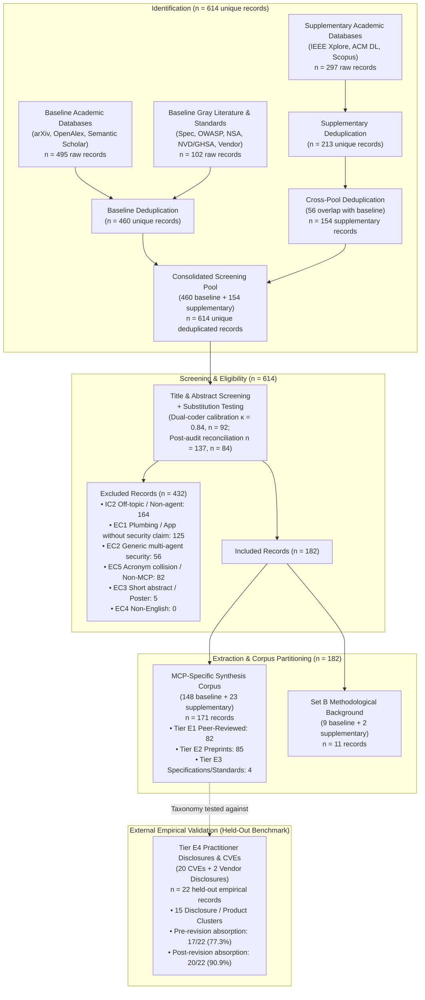

# Figure 1: PRISMA-ScR Flow Diagram

**Figure 1 Caption:**  
PRISMA-ScR flow diagram illustrating the identification, screening, and inclusion phases across baseline (460 records) and supplementary academic searches (154 records), achieving exact arithmetic closure across all 614 records ($182\text{ included} + 432\text{ excluded} = 614$). The complete extracted corpus comprises 171 MCP-specific synthesis records and 11 Set B background records. The 22-record E4 benchmark serves as an external, held-out validation set.
